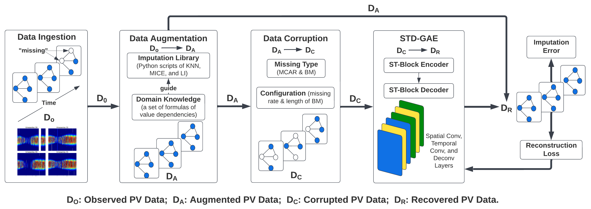
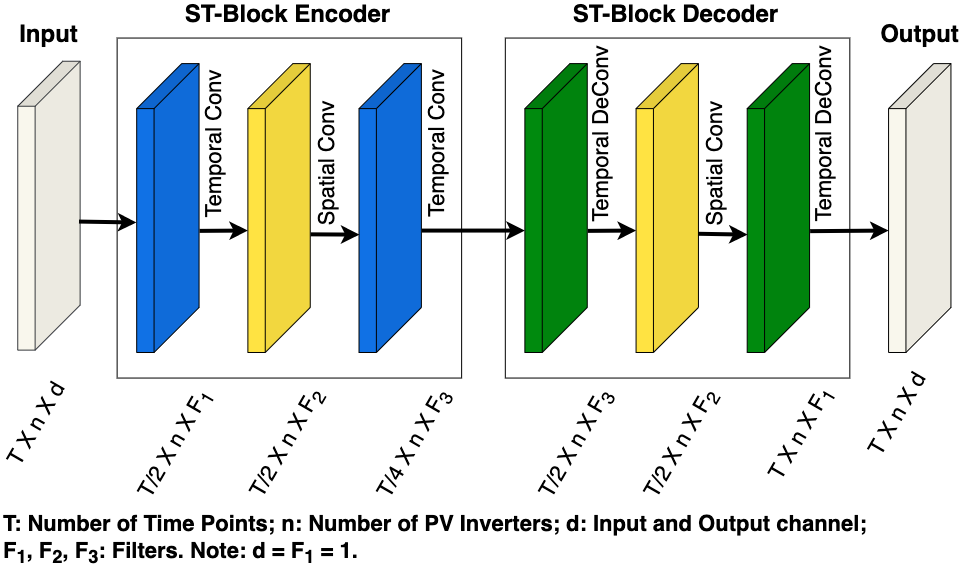
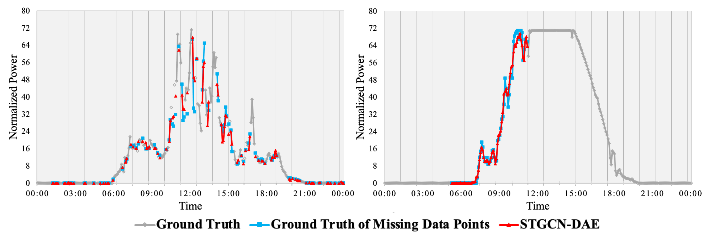

# Spatio-Temporal Denoising Graph Autoencoder (STD-GAE)

This repository contains the code for the reproducibility of the experiments presented in the paper "Spatio-Temporal Denoising Graph Autoencoders with Data Augmentation for Photovoltaics (PV) Data Imputation". In this paper, we propose a novel Spatio-Temporal Denoising Graph Autoencoder (STD-GAE) framework for PV timeseries data imputation and achieve state-of-the-art results on real-world PV benchmarks.

<h2 align=Left>STD-GAE in a nutshell</h2>

Our paper introduces __STD-GAE__, a method and an architecture that exploits temporal correlation, spatial coherence, and value dependencies from domain knowledge to recover missing data. STD-GAE features domain-knowledge aware data augmentation module and data corruption to create plausible variations of missing data patterns (configurable missing data masks). To improve the accuracy of imputation accuracy at PV fleet level, STD-GAE integrates spatiotemporal graph convolution layers (to recover local missing data by observed “neighboring” PV plants) and denoising autoencoder (to recover corrupted data from augmented counterpart).

  
**Fig. 1: Overview of STD-GAE Imputation Framework.**

  
**Fig. 2: Structure of the Spatial Layers and Temporal Layers in the Proposed STD-GAE.**

## Organization of the code

All the code for the models described in the paper can be found in *scripts/STD-GAE.ipynb*, *scripts/MIDA.ipynb*, and *scripts/LRTC-TNN.ipynb*. We provide a publuic PV power dataset for users to validate our proposed imputation framework. The public dataset (sampled from: https://datahub.duramat.org/dataset/phoenix.) consists of two parts the location file: *data/W_35.csv* and the timeseries data file *data/norm_power_35.csv*. 

## Results  
We have evaluated our proposed model on two real-world PV datasets. Experimental results show that STD-GAE achieves a gain of 43.14% in imputation accuracy and remains less sensitive to missing rate, different seasons, and missing scenarios,
compared with state-of-the-art data imputation methods such as
MIDA and LRTC-TNN. 
  

**Fig. 3: Imputation Errors and Impact of Missing Scenarios and Severity (results of Mean Imputation are out of scale).**

  
**Fig. 4: Imputation Results of the Proposed STD-GAE (left: 40% MCAR, right: 6-hours BM).**

